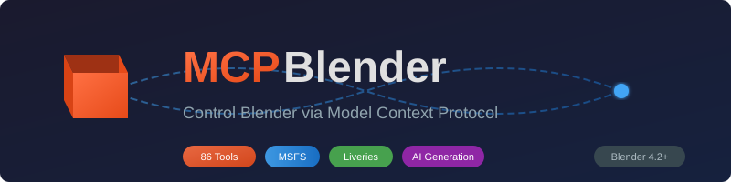

<p align="center">
  
</p>

<p align="center">
  <a href="https://badge.fury.io/py/mcp-blender"></a>
  <a href="https://www.python.org/downloads/"></a>
  <a href="https://www.blender.org/"></a>
  <a href="https://opensource.org/licenses/MIT"></a>
</p>

<p align="center">
  <strong>Control Blender via the Model Context Protocol (MCP)</strong><br>
  Enable AI assistants like Claude to directly manipulate Blender scenes, create objects, apply materials, render images, and much more.
</p>

**Supports Blender 4.2 LTS and Blender 5.0**

## Features

- **100 tools** for comprehensive Blender control
- **Scene management** - Create, modify, and query scenes
- **Object manipulation** - Create primitives, transform, duplicate, join/separate
- **Materials & textures** - Create materials, set colors, configure Principled BSDF
- **Modifiers** - Add and configure 28+ modifier types
- **Animation** - Keyframes, actions, playback control
- **Rendering** - Render images/animations, configure engines
- **Import/Export** - glTF, FBX, OBJ, STL support
- **MSFS 2020/2024 content creation** - LOD systems, collision meshes, MSFS materials, animation events
- **MSFS aircraft livery tools** - Paint workflows, template support, AI-assisted livery transfer
- **Poly Haven integration** - Search and download free HDRIs, textures, and models
- **AI model generation** - Generate 3D models from text or images via multiple backends (Rodin, Meshy, Tripo AI, TripoSR, Hunyuan3D, and more)
- **AI self-refinement loop** - Render, analyze with vision AI, fix, re-render until converged
- **Script execution** - Run arbitrary Python/bmesh code in Blender
- **Mesh processing** - Cleanup, optimize, decimate, remesh, and auto-UV generated models

## Architecture

```
┌─────────────────┐     stdio      ┌─────────────────┐     TCP/JSON-RPC     ┌─────────────────┐
│   Claude Code   │ ◄────────────► │   MCP Server    │ ◄─────────────────► │  Blender Addon  │
│   (AI Client)   │                │  (Python proc)  │      port 9876       │ (socket server) │
└─────────────────┘                └─────────────────┘                      └─────────────────┘
```

The MCP server communicates with Claude Code via stdio and connects to a Blender addon via TCP sockets. The addon runs a non-blocking server inside Blender using `bpy.app.timers`.

### Self-Refinement Loop

```
┌───────────┐  execute_script  ┌─────────┐  render_multi_angle  ┌──────────────┐
│   Claude   │ ──────────────► │ Blender  │ ───────────────────► │  PNG Images  │
│  (AI LLM)  │                 │  (bpy)   │                      └──────┬───────┘
└─────┬──────┘                 └─────────┘                             │
      │                                                  analyze_viewport
      │  fix script                                                    │
      │  (loop)                                                        ▼
      │                                                     ┌──────────────────┐
      └─────────────────────────────────────────────────────│  Ollama Vision   │
                              feedback + score              │  (llama3.2-11b)  │
                                                            └──────────────────┘
```

The refinement loop lets Claude iteratively improve 3D models: generate mesh with `execute_script`, render from multiple angles, analyze with a vision model, then apply fixes — repeating until the quality score converges.

## Installation

### 1. Install the MCP Server

```bash
pip install mcp-blender
```

Or install from source:

```bash
git clone https://github.com/RFingAdam/mcp-blender
cd mcp-blender
pip install -e .
```

### 2. Install the Blender Addon

**Option A: From ZIP (recommended)**

1. Download `blender_mcp_addon.zip` from the [releases page](https://github.com/RFingAdam/mcp-blender/releases)
2. In Blender: **Edit → Preferences → Add-ons → Install...**
3. Select the ZIP file and click "Install Add-on"
4. Enable "MCP Server Addon" by checking the box

**Option B: From source (for development)**

Copy or symlink the addon folder to your Blender addons directory:

```bash
# Linux
ln -s /path/to/mcp-blender/addon/blender_mcp_addon ~/.config/blender/4.2/scripts/addons/

# macOS
ln -s /path/to/mcp-blender/addon/blender_mcp_addon ~/Library/Application\ Support/Blender/4.2/scripts/addons/

# Windows (run as administrator)
mklink /D "%APPDATA%\Blender Foundation\Blender\4.2\scripts\addons\blender_mcp_addon" "C:\path\to\mcp-blender\addon\blender_mcp_addon"
```

Then enable the addon in Blender preferences.

### 3. Configure Claude Code

Add to your Claude Code MCP settings (`~/.claude.json` or `~/.claude/settings.json`):

```json
{
  "mcpServers": {
    "blender": {
      "command": "mcp-blender",
      "args": ["--port", "9876"]
    }
  }
}
```

## Quick Start

1. **Start Blender** and open any project
2. In the 3D Viewport sidebar (press `N`), find the **"MCP Server"** panel
3. Click **"Start Server"** - you should see "Server running on port 9876"
4. **Start Claude Code** - the Blender tools should now be available

### Example Commands

Ask Claude to:

- *"Create a red cube at position (2, 0, 0)"*
- *"Add a subdivision surface modifier to the cube with 2 levels"*
- *"Set up a three-point lighting setup"*
- *"Render the scene to /tmp/render.png"*
- *"Search Poly Haven for brick textures and apply one to the cube"*
- *"Create a low-poly tree with bmesh, then refine it until it looks good"*

## Tools Reference

### Scene Tools (5)

| Tool | Description |
|------|-------------|
| `blender_scene_info` | Get scene name, frame range, object count, render settings |
| `blender_scene_new` | Create a new scene |
| `blender_scene_clear` | Remove all objects from the scene |
| `blender_scene_set_frame_range` | Set animation start/end frames |
| `blender_get_version` | Get Blender version and API info |

### Object Tools (10)

| Tool | Description |
|------|-------------|
| `blender_object_create` | Create primitives: cube, sphere, cylinder, plane, cone, torus, monkey, empty, camera, light |
| `blender_object_delete` | Delete object by name |
| `blender_object_list` | List all objects with types and visibility |
| `blender_object_get` | Get detailed object properties |
| `blender_object_transform` | Set location, rotation, and scale |
| `blender_object_duplicate` | Duplicate an object |
| `blender_object_join` | Join multiple objects into one |
| `blender_object_separate` | Separate object by loose parts, materials, or selection |
| `blender_object_parent` | Set parent-child relationships |
| `blender_object_select` | Select objects by name or pattern |

### Material Tools (6)

| Tool | Description |
|------|-------------|
| `blender_material_create` | Create a new material |
| `blender_material_assign` | Assign material to object |
| `blender_material_set_color` | Set base color (RGBA) |
| `blender_material_set_principled` | Configure Principled BSDF (metallic, roughness, etc.) |
| `blender_material_add_texture` | Add image texture to material |
| `blender_material_list` | List all materials |

### Modifier Tools (5)

| Tool | Description |
|------|-------------|
| `blender_modifier_add` | Add modifier (28+ types supported) |
| `blender_modifier_remove` | Remove modifier by name |
| `blender_modifier_apply` | Apply modifier to mesh |
| `blender_modifier_configure` | Set modifier parameters |
| `blender_modifier_list` | List modifiers on an object |

**Supported modifiers:** SUBSURF, BEVEL, SOLIDIFY, ARRAY, MIRROR, BOOLEAN, DECIMATE, REMESH, SMOOTH, LAPLACIANSMOOTH, TRIANGULATE, WIREFRAME, SKIN, ARMATURE, LATTICE, CURVE, SHRINKWRAP, SIMPLE_DEFORM, WAVE, DISPLACE, CAST, HOOK, MESH_DEFORM, SURFACE_DEFORM, WARP, LAPLACIANDEFORM, CORRECTIVE_SMOOTH, DATA_TRANSFER

### Animation Tools (7)

| Tool | Description |
|------|-------------|
| `blender_keyframe_insert` | Insert keyframe for property |
| `blender_keyframe_delete` | Delete keyframe |
| `blender_keyframe_list` | List keyframes on an object |
| `blender_action_create` | Create a new action |
| `blender_action_list` | List all actions |
| `blender_animation_play` | Play or pause animation |
| `blender_animation_goto_frame` | Jump to specific frame |

### Render Tools (5)

| Tool | Description |
|------|-------------|
| `blender_render_image` | Render current frame to file |
| `blender_render_animation` | Render animation sequence |
| `blender_render_set_engine` | Set render engine (CYCLES, BLENDER_EEVEE_NEXT, BLENDER_WORKBENCH) |
| `blender_render_set_resolution` | Set output resolution |
| `blender_render_screenshot` | Capture viewport screenshot |

### Export/Import Tools (6)

| Tool | Description |
|------|-------------|
| `blender_export_gltf` | Export to glTF/GLB format |
| `blender_export_fbx` | Export to FBX format |
| `blender_export_obj` | Export to OBJ format |
| `blender_export_stl` | Export to STL format |
| `blender_export_usd` | Export to USD format |
| `blender_import_file` | Import file (auto-detects format) |

### External Integration Tools (2)

| Tool | Description |
|------|-------------|
| `blender_polyhaven_search` | Search Poly Haven for HDRIs, textures, or models |
| `blender_polyhaven_download` | Download and apply Poly Haven asset |

### AI Texture Generation Tools (5)

Generate PBR textures, reference images, and inpaint textures using ComfyUI/SDXL.

| Tool | Description |
|------|-------------|
| `blender_ai_generate_texture` | Generate PBR texture set from text prompt (async, returns job_id) |
| `blender_ai_generate_texture_sync` | Generate PBR texture and wait for completion (synchronous) |
| `blender_ai_generate_reference_image` | Generate concept art / reference image from text |
| `blender_ai_inpaint_texture` | Inpaint a masked region of an existing texture |
| `blender_ai_texture_from_render` | Generate texture from depth/normal render via ControlNet |

### AI Evaluation & Refinement Tools (2)

Evaluate and iteratively improve 3D content using Ollama vision.

| Tool | Description |
|------|-------------|
| `blender_ai_evaluate` | Evaluate any render with category-specific scoring (model/texture/animation) |
| `blender_ai_refine` | Run one refinement iteration: render, evaluate, return scores and suggestions |

### AI 3D Generation Tools (21)

Multi-backend AI model generation with local and cloud options.

**Backend Management (4)**

| Tool | Description |
|------|-------------|
| `blender_ai_list_backends` | List available AI backends with status |
| `blender_ai_set_backend` | Set preferred backend (or "auto") |
| `blender_ai_get_backend_info` | Get backend capabilities and requirements |
| `blender_ai_configure_backend` | Configure backend-specific settings |

**Generation (5)**

| Tool | Description |
|------|-------------|
| `blender_ai_generate_model` | Generate 3D model from text or image (multi-backend) |
| `blender_ai_model_status` | Check generation status (with auto-import option) |
| `blender_ai_generate_variations` | Generate multiple variations of a prompt |
| `blender_ai_redo_generation` | Redo last generation with modifications |
| `blender_ai_cancel_generation` | Cancel in-progress generation |

**Mesh Processing (7)**

| Tool | Description |
|------|-------------|
| `blender_ai_mesh_cleanup` | Clean up mesh (remove doubles, fix normals) |
| `blender_ai_mesh_decimate` | Reduce polygon count intelligently |
| `blender_ai_mesh_remesh` | Retopologize mesh for better geometry |
| `blender_ai_mesh_optimize` | Full optimization pipeline |
| `blender_ai_auto_uv` | Generate UV maps for texturing |
| `blender_ai_fix_mesh_issues` | Auto-fix common mesh problems |
| `blender_ai_mesh_stats` | Get mesh statistics and analysis |

**Queue Management (3)**

| Tool | Description |
|------|-------------|
| `blender_ai_queue_list` | List all generation jobs |
| `blender_ai_queue_clear` | Clear completed/failed jobs |
| `blender_ai_get_history` | Get generation history |

### AI Self-Refinement Tools (7)

Iterative render-analyze-fix loop using vision AI for quality convergence.

| Tool | Description |
|------|-------------|
| `blender_execute_script` | Execute arbitrary Python/bmesh script in Blender's context |
| `blender_render_multi_angle` | Render object from multiple angles (front, right, top, perspective) |
| `blender_analyze_viewport` | Render and analyze with Ollama vision model for structured feedback |
| `blender_refine_iteration` | Run one refinement iteration: render, analyze, check convergence |
| `blender_refine_create_session` | Create a new refinement session to track iterative improvement |
| `blender_refine_get_session` | Get details and iteration history of a refinement session |
| `blender_refine_list_sessions` | List all refinement sessions with status and iteration counts |

### MSFS 2020/2024 Content Creation Tools (20)

Tools for creating Microsoft Flight Simulator compatible content.

| Tool | Description |
|------|-------------|
| `blender_msfs_create_lod_hierarchy` | Create LOD hierarchy from base mesh |
| `blender_msfs_decimate_for_lod` | Decimate mesh to target ratio |
| `blender_msfs_setup_lod_distances` | Configure LOD switch distances |
| `blender_msfs_get_lod_info` | Get LOD hierarchy information |
| `blender_msfs_setup_material` | Set up MSFS-specific material |
| `blender_msfs_create_glass_material` | Create glass/windshield material |
| `blender_msfs_create_emissive_material` | Create emissive/light material |
| `blender_msfs_get_material_presets` | List available material presets |
| `blender_msfs_create_collision_mesh` | Create simplified collision mesh |
| `blender_msfs_create_collision_box` | Create box collision primitive |
| `blender_msfs_create_collision_convex` | Create convex hull collision |
| `blender_msfs_tag_collision_type` | Tag mesh as collision object |
| `blender_msfs_add_animation_tag` | Add animation event marker |
| `blender_msfs_setup_visibility_animation` | Configure show/hide animation |
| `blender_msfs_configure_animation_loop` | Set loop behavior |
| `blender_msfs_list_animation_tags` | List all animation tags |
| `blender_msfs_export_model` | Export with LODs, collision, animations |
| `blender_msfs_validate_for_export` | Validate for MSFS compatibility |
| `blender_msfs_get_export_settings` | Get export settings |
| `blender_msfs_batch_export_lods` | Batch export LOD hierarchy |

See [MSFS_ROADMAP.md](docs/MSFS_ROADMAP.md) for detailed MSFS workflow documentation.

### MSFS Aircraft Livery Tools (18)

Tools for creating and transferring aircraft liveries for virtual airlines.

| Tool | Description |
|------|-------------|
| `blender_msfs_livery_setup_paint_mode` | Set up object for texture painting |
| `blender_msfs_livery_create_paint_layers` | Create paint layers (primer, base, cheatline, etc.) |
| `blender_msfs_livery_load_template_overlay` | Load reference template as overlay |
| `blender_msfs_livery_export_uv_layout` | Export UV layout for external painting |
| `blender_msfs_livery_set_paint_brush` | Configure brush presets (airbrush, hard edge, etc.) |
| `blender_msfs_livery_sample_color` | Sample color from reference image |
| `blender_msfs_livery_get_paint_presets` | Get available paint layer and brush presets |
| `blender_msfs_livery_get_aircraft_templates` | List supported aircraft (FBW, Fenix, PMDG, etc.) |
| `blender_msfs_livery_get_template_info` | Get detailed template info for aircraft |
| `blender_msfs_livery_download_template` | Download/generate aircraft templates |
| `blender_msfs_livery_analyze` | Analyze livery image for colors and elements |
| `blender_msfs_livery_transfer` | Transfer livery between aircraft types |
| `blender_msfs_livery_extract_colors` | Extract color palette from livery |
| `blender_msfs_livery_map_elements` | Map design elements between templates |
| `blender_msfs_livery_export_textures` | Export livery textures (PNG, TGA) |
| `blender_msfs_livery_create_package` | Create MSFS livery package structure |
| `blender_msfs_livery_convert_to_dds` | Convert textures to DDS format |
| `blender_msfs_livery_validate_package` | Validate livery package for MSFS |

**Supported Aircraft:**
- FlyByWire A32NX (freeware)
- Fenix A320/A319/A321
- PMDG 737/777
- iniBuilds A310/A320neo
- Aerosoft CRJ
- Just Flight BAe 146
- Generic template for custom aircraft

## Self-Refinement Loop

The refinement loop enables AI-driven iterative improvement of 3D models. Claude generates mesh code, renders it from multiple angles, analyzes with a vision model, and applies fixes until quality converges.

```
# 1. Create a refinement session
blender_refine_create_session(object_name="Tree", prompt="A realistic low-poly pine tree")

# 2. Generate initial mesh with bmesh script
blender_execute_script(script="import bmesh; ...")

# 3. Run refinement iteration (render + analyze + convergence check)
blender_refine_iteration(object_name="Tree", iteration=0, max_iterations=5)

# 4. Apply fixes based on feedback, then iterate
blender_execute_script(script="# fix issues from analysis ...")
blender_refine_iteration(object_name="Tree", iteration=1, previous_score=0.6)

# 5. Check session history
blender_refine_get_session(session_id="...")
```

## External Integrations

### Poly Haven

[Poly Haven](https://polyhaven.com) provides free HDRIs, textures, and 3D models. No API key required.

```
# Search for assets
blender_polyhaven_search(query="brick", asset_type="textures")

# Download and apply
blender_polyhaven_download(asset_id="brick_wall_001", resolution="2k")
```

Assets are cached locally to avoid re-downloading.

### AI 3D Model Generation

Generate 3D models from text prompts or images using multiple backends - both cloud APIs and local models.

**Available Backends:**

| Backend | Type | Requirements | Capabilities |
|---------|------|--------------|--------------|
| Hyper3D Rodin | Cloud | API key | Text-to-3D, Image-to-3D, High quality |
| Meshy.ai | Cloud | API key | Text-to-3D, Image-to-3D, Texturing |
| Tripo AI | Cloud | API key | Text-to-3D, Image-to-3D, Fast |
| TripoSR | Local | 4GB VRAM | Image-to-3D, Very fast (<1s) |
| Stable Fast 3D | Local | 6GB VRAM | Image-to-3D, Fast, Stable results |
| Hunyuan3D | Local | 16GB VRAM | Text-to-3D, Image-to-3D, High quality |
| Ollama Vision | Local | 8GB VRAM | Image understanding (helper) |
| ComfyUI | Local | Varies | Custom workflows |

**Setup (Cloud backends):** Set API keys as environment variables:

```bash
export RODIN_API_KEY="your-rodin-key"      # Hyper3D Rodin
export MESHY_API_KEY="your-meshy-key"      # Meshy.ai
export TRIPO_API_KEY="your-tripo-key"      # Tripo AI
```

**Setup (Local backends):** Install the required models:

```bash
# TripoSR (fast image-to-3D)
pip install triposr

# Ollama with vision model
ollama pull llava
```

**Usage:**

```
# Auto-select best available backend
blender_ai_generate_model(prompt="a wooden chair", style="realistic")

# Use specific backend
blender_ai_generate_model(prompt="a robot", backend="triposr")

# Image-to-3D with local model
blender_ai_generate_model(image_path="/path/to/image.png", backend="triposr")

# Check status and import with optimization
blender_ai_model_status(job_id="abc123", auto_import=true, optimize_mesh=true)

# Generate variations
blender_ai_generate_variations(prompt="a coffee mug", count=3)

# Process imported mesh
blender_ai_mesh_optimize(object_name="imported_model", cleanup=true, decimate=true)
```

**Supported styles:** realistic, cartoon, low_poly, sculpture, anime

**Supported formats:** glb (default), gltf, fbx, obj, usdz

## Version Compatibility

This addon includes a compatibility layer for Blender API differences:

| Feature | Blender 4.2 | Blender 5.0 |
|---------|-------------|-------------|
| Action FCurves | `action.fcurves` | `action.slots[].layers[].strips[].channels` |
| mathutils precision | float64 | float32 |
| Render engine | `BLENDER_EEVEE` (< 4.2) | `BLENDER_EEVEE_NEXT` (4.2+) |

The compatibility layer handles these differences automatically.

## Configuration Options

### MCP Server

```bash
mcp-blender --help

Options:
  --host TEXT   Blender addon host [default: localhost]
  --port INT    Blender addon port [default: 9876]
```

### Blender Addon

The addon panel in the 3D Viewport sidebar offers:

- **Port:** TCP port for the socket server (default: 9876)
- **Start/Stop Server:** Toggle the MCP socket server

## Troubleshooting

### "Connection refused" errors

1. Make sure Blender is running
2. Check the MCP Server panel shows "Server running"
3. Verify the port matches (default: 9876)
4. Check firewall settings if running on different machines

### "Tool not found" errors

1. Restart Claude Code after adding the MCP server config
2. Verify `mcp-blender` is installed: `mcp-blender --help`
3. Check Claude Code's MCP server logs

### Addon not appearing in Blender

1. Check Blender's console for errors (Window → Toggle System Console on Windows)
2. Verify Python version compatibility (Blender 4.2+ uses Python 3.11+)
3. Try reinstalling the addon

### Poly Haven downloads fail

1. Check internet connectivity
2. Verify the asset ID exists on polyhaven.com
3. Check disk space for cache directory

### AI generation not working

1. Check available backends with `blender_ai_list_backends`
2. For cloud backends, verify API keys are set (RODIN_API_KEY, MESHY_API_KEY, TRIPO_API_KEY)
3. For local backends, verify models are installed and have sufficient VRAM
4. Monitor job status with `blender_ai_model_status`
5. Check generation history with `blender_ai_get_history`

## Development

### Setup

```bash
# Clone repository
git clone https://github.com/RFingAdam/mcp-blender
cd mcp-blender

# Create virtual environment
python -m venv .venv
source .venv/bin/activate  # or .venv\Scripts\activate on Windows

# Install with dev dependencies
pip install -e ".[dev]"
```

### Running Tests

```bash
# Run unit tests (no Blender required)
pytest tests/ --ignore=tests/blender_integration_test.py

# Run Blender integration tests
blender --background --python tests/blender_integration_test.py
```

### Linting

```bash
ruff check .
ruff format .
```

### Building the Addon ZIP

```bash
python scripts/package_addon.py
# Creates dist/blender_mcp_addon-<version>.zip
```

### Project Structure

```
mcp-blender/
├── src/mcp_blender/           # MCP server package
│   ├── server.py              # Tool definitions and MCP handlers
│   ├── blender_client.py      # TCP client for Blender communication
│   └── types.py               # Shared type definitions
├── addon/blender_mcp_addon/   # Blender addon
│   ├── __init__.py            # Addon registration and UI
│   ├── socket_server.py       # TCP server using bpy.app.timers
│   ├── handlers.py            # Command handlers
│   ├── compat.py              # Version compatibility layer
│   ├── validation.py          # Parameter validation
│   ├── utils.py               # Shared utility functions
│   ├── external/              # External integrations
│   │   ├── cache.py           # Asset caching system
│   │   ├── polyhaven.py       # Poly Haven API client
│   │   ├── refinement.py      # Refinement session state management
│   │   ├── ai_models.py       # AI generation orchestration
│   │   ├── mesh_processing.py # Mesh cleanup and optimization
│   │   ├── job_queue.py       # Persistent job tracking
│   │   └── ai_backends/       # AI backend implementations
│   │       ├── base.py        # Abstract base class
│   │       ├── rodin.py       # Hyper3D Rodin (cloud)
│   │       ├── meshy.py       # Meshy.ai (cloud)
│   │       ├── tripo_ai.py    # Tripo AI (cloud)
│   │       ├── triposr.py     # TripoSR (local)
│   │       ├── hunyuan3d.py   # Hunyuan3D (local)
│   │       ├── ollama_vision.py # Ollama Vision (local)
│   │       ├── stable_fast_3d.py # Stable Fast 3D (local)
│   │       └── comfyui.py     # ComfyUI integration
│   └── msfs/                  # MSFS content creation tools
│       ├── lod.py             # LOD hierarchy management
│       ├── materials.py       # MSFS material extensions
│       ├── collision.py       # Collision mesh tools
│       ├── animation.py       # Animation tags and events
│       ├── export.py          # MSFS export utilities
│       └── livery/            # Aircraft livery tools
│           ├── painting.py    # Texture painting workflow
│           ├── templates.py   # Aircraft template definitions
│           ├── transfer.py    # AI-assisted livery transfer
│           └── export.py      # Livery package creation
├── assets/                    # Static and generated assets
│   ├── generated/             # AI-generated models & textures (gitignored)
│   │   └── mototok/           # Mototok Spacer 8600 project
│   ├── banner.svg             # Project banner
│   └── logo.svg               # Project logo
├── tests/                     # Test suite
├── scripts/                   # Build scripts
└── docs/                      # Documentation
```

## Contributing

Contributions are welcome! Please:

1. Fork the repository
2. Create a feature branch
3. Make your changes with tests
4. Submit a pull request

## License

MIT License - see [LICENSE](LICENSE) for details.

## Acknowledgments

- [Model Context Protocol](https://modelcontextprotocol.io/) by Anthropic
- [Blender](https://www.blender.org/) by the Blender Foundation
- [Poly Haven](https://polyhaven.com/) for free 3D assets
- [Hyper3D Rodin](https://hyperhuman.deemos.com/) for AI model generation
