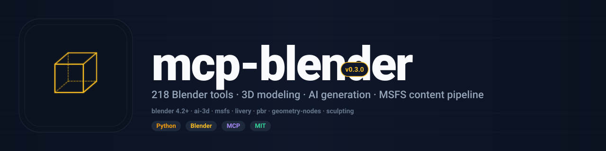

<div align="center">



<br/>

[](LICENSE)
[](https://www.python.org/downloads/)
[](https://www.blender.org/)
[](https://modelcontextprotocol.io)
[](https://github.com/RFingAdam/eng-mcp-suite)

**Control Blender from any MCP client — 218 tools across modeling, materials, sculpting, animation, AI 3D generation, and MSFS content creation.**
**Drive it from your IDE, terminal, or AI agent and run an iterative render-analyze-refine loop without leaving Blender.**

[Quick start](#quick-start) ·
[Tools](#tools) ·
[Self-refinement loop](#self-refinement-loop) ·
[Workflows](#workflows) ·
[Documentation](#documentation)

</div>

> Supports **Blender 4.2 LTS** and **Blender 5.0**.

---

## What is mcp-blender?

`mcp-blender` is an MCP server that exposes 218 Blender tools to any
MCP-compatible AI client (Claude Desktop, Claude Code, Codex CLI, …).
The MCP server speaks the Model Context Protocol over stdio; a Blender
addon listens on a local TCP socket and dispatches into Blender's
`bpy` API on the main thread via `bpy.app.timers`.

```
┌─────────────────┐    stdio     ┌─────────────────┐   TCP/JSON-RPC   ┌─────────────────┐
│  MCP client     │ ◄──────────► │   MCP Server    │ ◄──────────────► │  Blender Addon  │
│  (Claude / …)   │              │  (Python proc)  │   port 9876      │  (bpy.app.timers)│
└─────────────────┘              └─────────────────┘                  └─────────────────┘
```

**What it does well:**

- 🤖 **AI-native via MCP.** First-class [Model Context Protocol](https://modelcontextprotocol.io)
  server with **218 tools** across every Blender pipeline stage.
- 🎨 **End-to-end coverage.** Scene, object, mesh, material, modifier,
  animation, render, export, baking, geometry nodes, sculpting, rigging,
  physics, annotations.
- ✈️ **MSFS-ready.** Full **Microsoft Flight Simulator 2020 / 2024**
  content pipeline: LOD hierarchies, collision meshes, MSFS materials,
  animation tags, livery painting + transfer for FBW / Fenix / PMDG /
  iniBuilds / Aerosoft.
- 🧠 **AI 3D generation.** Multi-backend (Hyper3D Rodin, Meshy, Tripo,
  TripoSR, Stable Fast 3D, Hunyuan3D, ComfyUI) text/image-to-3D with
  auto mesh cleanup and decimation.
- 🔁 **Self-refinement loop.** `render_multi_angle` → `analyze_viewport`
  → `refine_iteration` against an Ollama vision model converges geometry
  toward a target prompt.
- 🪨 **Poly Haven built-in.** Free HDRIs, textures, and models with no
  API key.
- 🔒 **MIT licensed.**

---

## Quick start

### 1. Install the MCP server

```bash
pip install mcp-blender
```

Or from source:

```bash
git clone https://github.com/RFingAdam/mcp-blender
cd mcp-blender
pip install -e .
```

### 2. Install the Blender addon

**Option A — from ZIP (recommended):**

1. Download `blender_mcp_addon.zip` from the [releases page](https://github.com/RFingAdam/mcp-blender/releases).
2. In Blender: **Edit → Preferences → Add-ons → Install…**
3. Select the ZIP, enable "MCP Server Addon".

**Option B — from source:**

```bash
# Linux
ln -s /path/to/mcp-blender/addon/blender_mcp_addon \
      ~/.config/blender/4.2/scripts/addons/

# macOS
ln -s /path/to/mcp-blender/addon/blender_mcp_addon \
      ~/Library/Application\ Support/Blender/4.2/scripts/addons/

# Windows (admin)
mklink /D "%APPDATA%\Blender Foundation\Blender\4.2\scripts\addons\blender_mcp_addon" ^
       "C:\path\to\mcp-blender\addon\blender_mcp_addon"
```

Then enable the addon in Blender preferences.

### 3. Configure your MCP client

```json
{
  "mcpServers": {
    "blender": {
      "command": "mcp-blender",
      "args": ["--port", "9876"]
    }
  }
}
```

### 4. Three surfaces, same loop

<table>
<tr>
<td valign="top" width="50%">

**Blender side**

1. Open Blender.
2. Press `N` in the 3D viewport.
3. Open the "MCP Server" panel.
4. Click "Start Server" — confirm "Server running on port 9876".

</td>
<td valign="top" width="50%">

**Client side**

Restart Claude / Codex. The Blender tools appear in the tool list.
Try:

> *"Create a red cube at (2, 0, 0), add a subdivision surface modifier
> with 2 levels, render it to /tmp/render.png."*

</td>
</tr>
</table>

---

## Tools

218 MCP tools, grouped by Blender pipeline stage. Full grouped
reference (with source links) in [`docs/tools.md`](docs/tools.md).

| Category                | Tools | Examples                                                              |
| ----------------------- | ----: | --------------------------------------------------------------------- |
| Scene                   |     5 | `scene_info`, `scene_new`, `scene_clear`, `scene_set_frame_range`     |
| Object                  |    10 | `object_create`, `object_transform`, `object_duplicate`, `object_join`|
| Mesh editing            |    24 | `mesh_extrude`, `mesh_bevel`, `mesh_loop_cut`, `mesh_bridge`          |
| Materials + nodes       |    13 | `material_create`, `material_inspect_graph`, `material_node_add`, `material_procedural_preset` |
| Modifiers (28+ types)   |     5 | `modifier_add`, `modifier_configure`, `modifier_apply`                |
| Animation + keyframes   |     7 | `keyframe_insert`, `animation_play`, `action_create`                  |
| Render                  |     5 | `render_image`, `render_animation`, `render_multi_angle`, `render_screenshot` |
| Export / import         |     6 | `export_gltf`, `export_fbx`, `export_obj`, `export_stl`, `export_usd` |
| Measurement + validation|     7 | `measure_volume`, `validate_dimensions`, `validate_mesh_quality`      |
| Baking                  |     6 | `bake_pbr_batch`, `bake_highpoly_to_lowpoly`, `bake_curvature`        |
| Geometry nodes          |     7 | `geonode_scatter_instances`, `geonode_array_grid`, `geonode_extrude_profile` |
| Sculpting               |     8 | `sculpt_setup`, `sculpt_mesh_filter`, `sculpt_to_retopo`              |
| Rigging + armature      |     8 | `armature_create`, `autorig_preset`, `constraint_preset`, `rig_validate` |
| Physics                 |     6 | `physics_rigid_body_add`, `physics_cloth_add`, `physics_fluid_quick`  |
| Collections + system    |     8 | `collection_create`, `undo`, `redo`, `save`, `save_as`                |
| Annotations + grease pencil | 6 | `annotation_dimension`, `grease_pencil_markup`                       |
| **MSFS content**        |    20 | LOD hierarchy, collision, MSFS materials, animation tags, export      |
| **MSFS livery**         |    18 | Paint mode, layers, brushes, template overlay, transfer, packaging    |
| **AI 3D generation**    |    21 | Multi-backend text/image-to-3D + mesh cleanup pipeline                |
| AI texture generation   |     5 | PBR sets from prompt, reference images, inpainting, ControlNet        |
| AI evaluation           |     2 | `ai_evaluate`, `ai_refine` (Ollama vision)                            |
| AI self-refinement      |     7 | `execute_script`, `analyze_viewport`, `refine_iteration`, sessions   |
| Poly Haven              |     2 | `polyhaven_search`, `polyhaven_download`                              |

Full per-tool argument tables: [`docs/tools.md`](docs/tools.md). All
tool source lives under
[`src/mcp_blender/`](https://github.com/RFingAdam/mcp-blender/tree/main/src/mcp_blender)
(server side) and
[`addon/blender_mcp_addon/`](https://github.com/RFingAdam/mcp-blender/tree/main/addon/blender_mcp_addon)
(Blender side).

---

## Self-refinement loop

`mcp-blender` ships an iterative render-analyze-fix loop. The agent
generates mesh code, renders from multiple angles, an Ollama vision
model scores the result, and the agent applies fixes until the score
converges.

```
┌───────────┐  execute_script  ┌─────────┐  render_multi_angle  ┌──────────────┐
│  agent    │ ──────────────► │ Blender  │ ───────────────────► │  PNG images  │
│  (LLM)    │                 │  (bpy)   │                      └──────┬───────┘
└─────┬─────┘                 └─────────┘                              │
      │                                                  analyze_viewport
      │  apply fix                                                     │
      │  (loop)                                                        ▼
      │                                                     ┌──────────────────┐
      └─────────────────────────────────────────────────────│  Ollama Vision   │
                              feedback + score              │  (llama3.2-11b)  │
                                                            └──────────────────┘
```

Skeleton call sequence:

```python
# 1. Open a refinement session
blender_refine_create_session(object_name="Tree", prompt="A realistic low-poly pine tree")

# 2. Generate initial mesh
blender_execute_script(script="import bmesh; ...")

# 3. Iterate
blender_refine_iteration(object_name="Tree", iteration=0, max_iterations=5)

# 4. Apply fixes from feedback, iterate again
blender_execute_script(script="# fix issues from analysis ...")
blender_refine_iteration(object_name="Tree", iteration=1, previous_score=0.6)

# 5. Inspect session
blender_refine_get_session(session_id="...")
```

See [`docs/usage.md`](docs/usage.md) for a full walkthrough.

---

## External integrations

### Poly Haven

[Poly Haven](https://polyhaven.com) provides free HDRIs, textures, and
3D models. No API key required.

```
blender_polyhaven_search(query="brick", asset_type="textures")
blender_polyhaven_download(asset_id="brick_wall_001", resolution="2k")
```

Assets are cached locally.

### AI 3D model generation

Multi-backend text/image-to-3D — cloud APIs and local models.

| Backend         | Type   | Requirements    | Capabilities                          |
| --------------- | ------ | --------------- | ------------------------------------- |
| Hyper3D Rodin   | Cloud  | API key         | Text-to-3D, Image-to-3D, high quality |
| Meshy.ai        | Cloud  | API key         | Text-to-3D, Image-to-3D, texturing    |
| Tripo AI        | Cloud  | API key         | Text-to-3D, Image-to-3D, fast         |
| TripoSR         | Local  | 4 GB VRAM       | Image-to-3D, very fast (< 1 s)        |
| Stable Fast 3D  | Local  | 6 GB VRAM       | Image-to-3D, fast, stable             |
| Hunyuan3D       | Local  | 16 GB VRAM      | Text-to-3D, Image-to-3D, high quality |
| Ollama Vision   | Local  | 8 GB VRAM       | Image understanding (helper)          |
| ComfyUI         | Local  | varies          | Custom workflows                      |

Cloud setup:

```bash
export RODIN_API_KEY="your-rodin-key"
export MESHY_API_KEY="your-meshy-key"
export TRIPO_API_KEY="your-tripo-key"
```

Local setup:

```bash
pip install triposr     # fast image-to-3D
ollama pull llava       # vision model
```

Usage:

```
blender_ai_generate_model(prompt="a wooden chair", style="realistic")
blender_ai_generate_model(image_path="/path/to/image.png", backend="triposr")
blender_ai_model_status(job_id="abc123", auto_import=true, optimize_mesh=true)
```

Supported styles: `realistic`, `cartoon`, `low_poly`, `sculpture`, `anime`.
Formats: `glb` (default), `gltf`, `fbx`, `obj`, `usdz`.

---

## Workflows

`mcp-blender` is a creative-tooling tangent in
[eng-mcp-suite](https://github.com/RFingAdam/eng-mcp-suite) — it doesn't
fit the engineering compliance loop directly, but it shares brand,
docs, and MCP wiring with the rest of the family.

Part of [eng-mcp-suite](https://github.com/RFingAdam/eng-mcp-suite).

---

## Documentation

- 📘 **[Quick Start](docs/index.md)** — install through first call.
- 🛠️ **[Tool reference](docs/tools.md)** — all 218 tools grouped by stage.
- 📐 **[Usage examples](docs/usage.md)** — end-to-end walkthroughs (self-refine, MSFS, livery).
- 🏗️ **[Architecture](docs/architecture.md)** — how this MCP fits in eng-mcp-suite.
- ✈️ **[MSFS roadmap](docs/MSFS_ROADMAP.md)** — MSFS content workflow.

---

## Part of eng-mcp-suite

<sub>This MCP server is part of</sub>

[](https://github.com/RFingAdam/eng-mcp-suite)

<sub>An open umbrella for engineering MCP servers across RF, EMC, PCB,
signal integrity, EM simulation, and lab test. Same brand, same docs
structure, designed to compose. See the
[full catalog](https://github.com/RFingAdam/eng-mcp-suite#whats-included)
or jump to a sibling:</sub>

| Domain                      | Sibling MCPs                                                                 |
| --------------------------- | ---------------------------------------------------------------------------- |
| **RF / Transmission lines** | [lineforge](https://github.com/RFingAdam/lineforge)                          |
| **EMC regulatory**          | [mcp-emc-regulations](https://github.com/RFingAdam/mcp-emc-regulations)      |
| **PCB / SI**                | mcp-pcb-emcopilot *(private — public soon)*                                  |
| **EM simulation**           | mcp-openems, mcp-nec2-antenna *(private — public soon)*                      |
| **Diagrams**                | [drawio-engineering-mcp](https://github.com/RFingAdam/drawio-engineering-mcp) |
| **3D / rendering**          | **mcp-blender** *(this repo)*                                                |
| **Remote access**           | [mcp-remote-access](https://github.com/RFingAdam/mcp-remote-access)          |
| **Lab gear**                | [copper-mountain-vna-mcp](https://github.com/RFingAdam/copper-mountain-vna-mcp), mcp-rs-spectrum-analyzer, mcp-rs-siggen, mcp-rs-cmw500 |

---

## Configuration

### MCP server

```bash
mcp-blender --help

Options:
  --host TEXT   Blender addon host  [default: localhost]
  --port INT    Blender addon port  [default: 9876]
```

### Blender addon panel

In the 3D viewport sidebar:

- **Port** — TCP port for the socket server (default 9876).
- **Start / Stop Server** — toggle the MCP socket server.

---

## Version compatibility

The addon ships a compatibility layer for Blender API differences:

| Feature           | Blender 4.2                | Blender 5.0                                            |
| ----------------- | -------------------------- | ------------------------------------------------------ |
| Action FCurves    | `action.fcurves`           | `action.slots[].layers[].strips[].channels`            |
| mathutils         | float64                    | float32                                                |
| Render engine     | `BLENDER_EEVEE` (< 4.2)    | `BLENDER_EEVEE_NEXT` (4.2+)                            |

The layer handles these differences automatically.

---

## Troubleshooting

**"Connection refused"** — make sure Blender is running, the MCP Server
panel shows "Server running", the port matches, and the firewall allows
local TCP on `9876`.

**"Tool not found"** — restart Claude / Codex after editing the MCP
config; verify `mcp-blender --help` runs; check the client's MCP server
log.

**Addon not appearing in Blender** — check Blender's system console for
errors; verify Python version (Blender 4.2+ uses Python 3.11+); try
reinstalling.

**Poly Haven downloads fail** — check connectivity; verify the asset
ID exists on polyhaven.com; check disk space.

**AI generation not working** — `blender_ai_list_backends` shows status;
verify API keys (`RODIN_API_KEY`, `MESHY_API_KEY`, `TRIPO_API_KEY`) for
cloud; verify models / VRAM for local; monitor with
`blender_ai_model_status`; check history with `blender_ai_get_history`.

---

## Development

```bash
git clone https://github.com/RFingAdam/mcp-blender
cd mcp-blender
python -m venv .venv
source .venv/bin/activate   # .venv\Scripts\activate on Windows
pip install -e ".[dev]"
```

Tests:

```bash
pytest tests/ --ignore=tests/blender_integration_test.py
blender --background --python tests/blender_integration_test.py
```

Lint:

```bash
ruff check .
ruff format .
```

Build the addon ZIP:

```bash
python scripts/package_addon.py
# → dist/blender_mcp_addon-<version>.zip
```

---

## Contributing

Contributions are welcome. Fork, branch, add tests, open a PR.
See [`CONTRIBUTING.md`](CONTRIBUTING.md).

---

## License

[MIT](LICENSE).

## Acknowledgments

- **[Blender Foundation](https://www.blender.org/)** — for Blender itself.
- **[Poly Haven](https://polyhaven.com/)** — for free 3D assets.
- **[Hyper3D Rodin](https://hyperhuman.deemos.com/)**, **[Meshy.ai](https://www.meshy.ai/)**, **[Tripo](https://www.tripo3d.ai/)**, **TripoSR**, **Stable Fast 3D**, **Hunyuan3D**, **ComfyUI** — AI 3D backends.
- **The MCP working group** — for the [Model Context Protocol](https://modelcontextprotocol.io) specification.

<div align="center">

<sub>Part of <a href="https://github.com/RFingAdam/eng-mcp-suite">eng-mcp-suite</a> — built for RF engineers, PCB designers, EMC labs, and AI agents.</sub>

</div>
